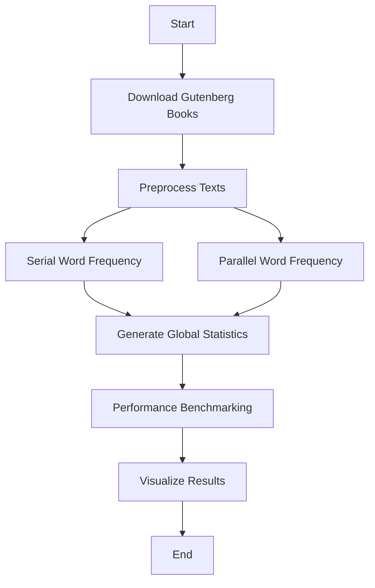

# 📚 Gutenberg Text Analysis: Parallel Processing Word Frequency Analyzer

## 🌟 Project Overview

This advanced Python project leverages multiprocessing and natural language processing techniques to perform comprehensive text analysis on a collection of books from Project Gutenberg. The project demonstrates sophisticated data processing strategies, including parallel computing, text preprocessing, and performance benchmarking.

## 🎯 Key Objectives

- Automated bulk book downloading from Project Gutenberg
- Advanced text preprocessing and cleaning
- Comparative analysis of serial vs. parallel processing
- Performance benchmarking of computational approaches
- Detailed word frequency analysis

## 🚀 Technical Features

### Text Processing
- Automatic NLTK resource management
- Comprehensive text preprocessing:
  - Lowercase conversion
  - Punctuation removal
  - Stopword elimination
  - Tokenization

### Performance Analysis
- Serial processing benchmark
- Parallel processing with dynamic core utilization
- Execution time visualization
- Scalability assessment across different process counts

### Visualization
- Matplotlib-generated performance graphs
- Detailed word frequency reports
- Global and book-specific word distribution insights

## 🛠 Technical Stack

### Languages
- Python 3.8+

### Core Libraries
- NLTK: Natural Language Processing
- Multiprocessing: Parallel computation
- Requests: HTTP book downloads
- Matplotlib: Performance visualization
- TQDM: Progress tracking

## 📦 Prerequisites

### System Requirements
- Python 3.8 or higher
- Minimum 4GB RAM recommended
- Active internet connection

### Recommended Development Environment
- Virtual environment (venv/conda)
- Jupyter Notebook
- Git for version control

## 🔧 Installation & Setup

### 1. Clone Repository
```bash
git clone https://github.com/yourusername/gutenberg-text-analysis.git
cd gutenberg-text-analysis
```

### 2. Create Virtual Environment
```bash
# Using venv
python -m venv venv
source venv/bin/activate  # Unix/macOS
venv\Scripts\activate     # Windows

# Using conda
conda create -n gutenberg-analysis python=3.9
conda activate gutenberg-analysis
```

### 3. Install Dependencies
```bash
pip install -r requirements.txt
```

## 🖥 Usage Instructions

### Running the Notebook
```bash
jupyter notebook
```

### Customization Options
- Modify `num_books` parameter to control download volume
- Adjust `top_n` to customize word frequency reporting
- Configure parallel processing settings

## 📊 Performance Metrics

### Processing Approaches
- **Serial Processing**: Sequential book analysis
- **Parallel Processing**: Concurrent book processing
- **Benchmarking**: Execution time across CPU cores

### Visualization
- Line graph showing execution time vs. number of processes
- Comparative analysis of serial and parallel processing efficiency

## 🧠 Algorithmic Insights

### Word Frequency Calculation
1. Text preprocessing
2. Tokenization
3. Stopword removal
4. Frequency aggregation
5. Statistical analysis

### Parallel Processing Strategy
- Dynamic process pool creation
- Load balancing
- Minimal overhead communication

## 🔍 Detailed Workflow



## 🚧 Potential Improvements
- Implement caching mechanism
- Add more advanced NLP techniques
- Create interactive visualization
- Expand preprocessing capabilities

## 🤝 Contributing Guidelines

1. Fork the repository
2. Create feature branch
3. Commit changes
4. Push to branch
5. Create pull request

### Contribution Areas
- Performance optimization
- Additional preprocessing techniques
- Visualization enhancements
- Error handling improvements


## 🙏 Acknowledgments
- Project Gutenberg
- NLTK Community
- Python Open Source Community


**Happy Text Analysis!** 📖🔍
